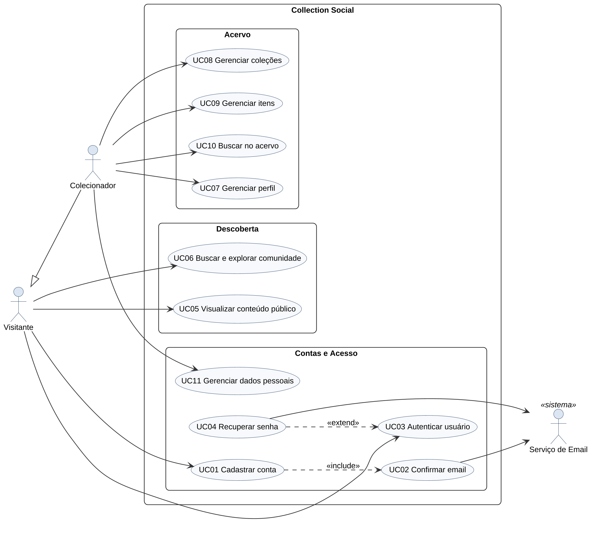
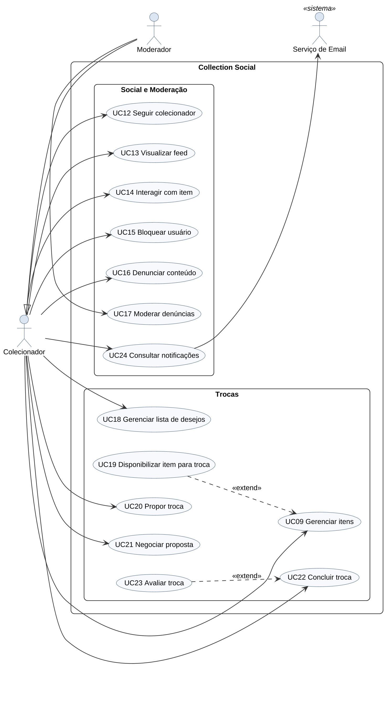
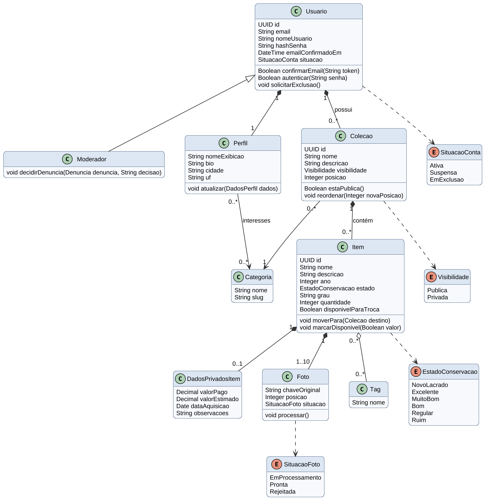
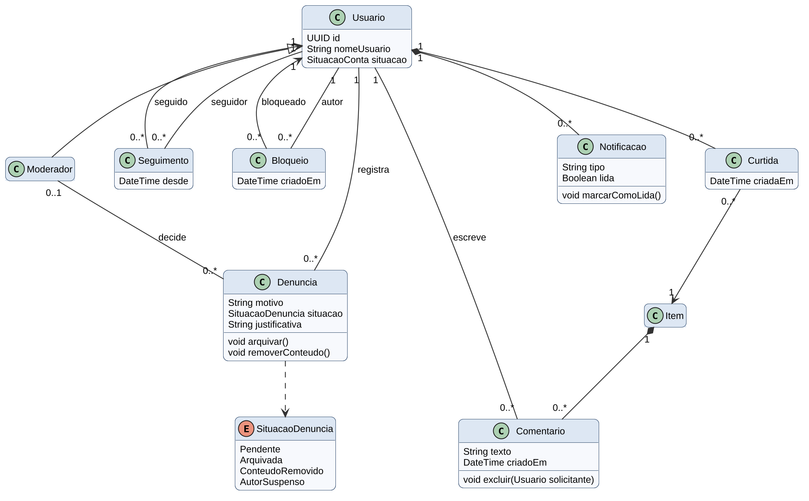
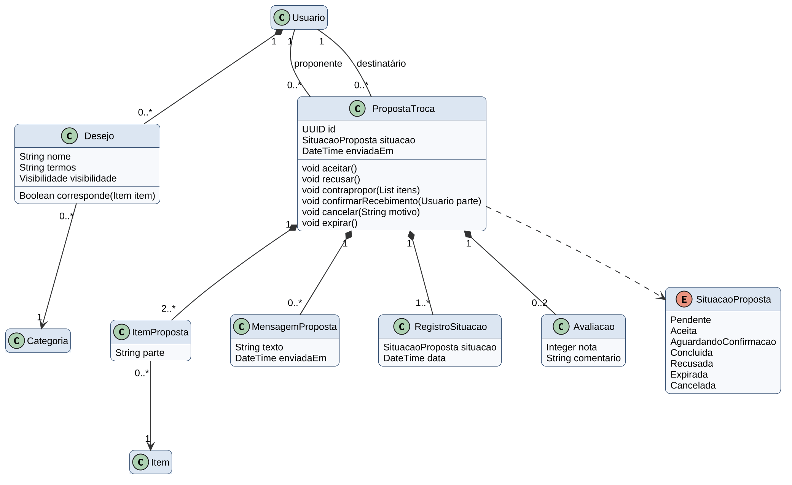
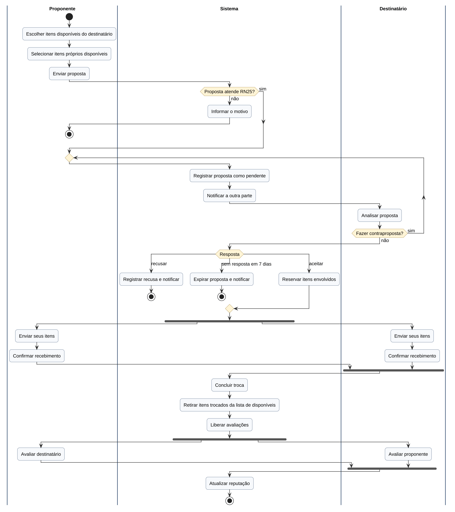
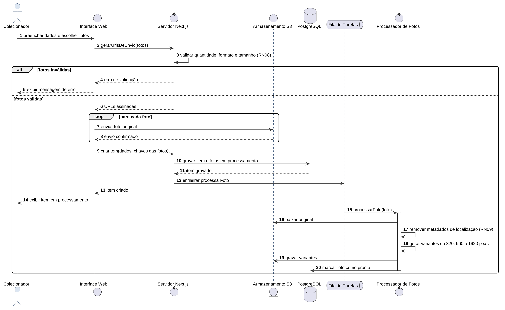
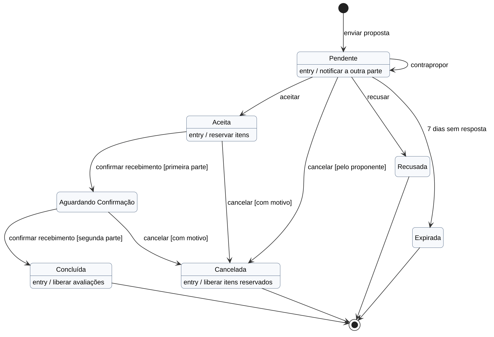
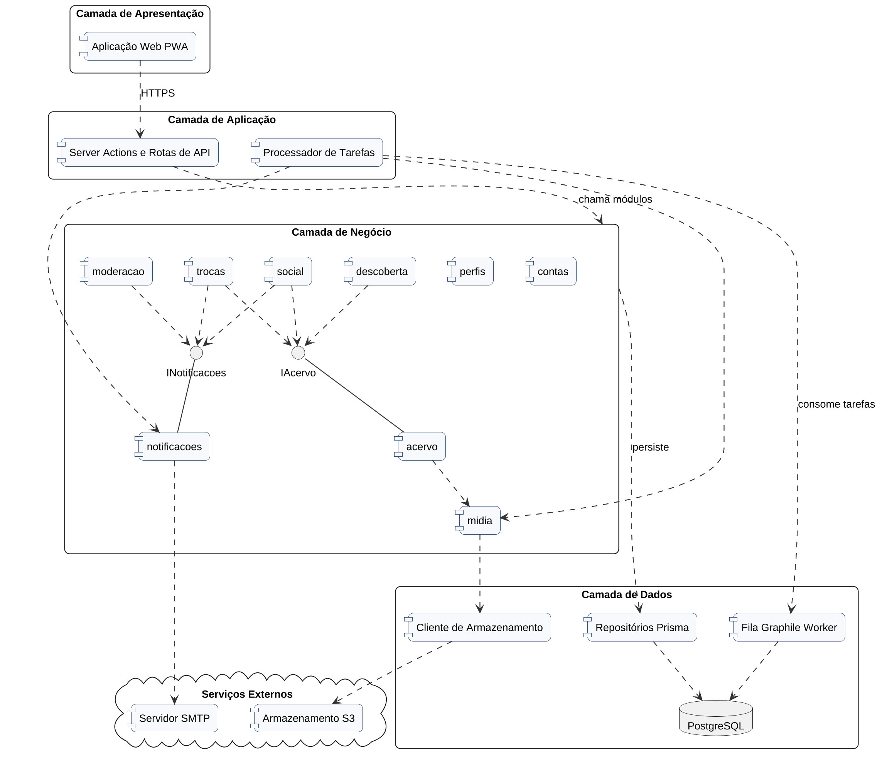
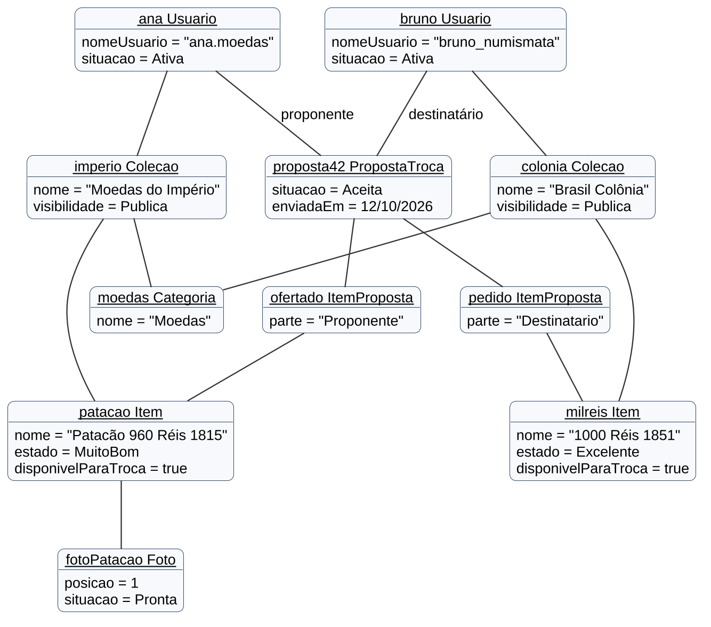

# INTRODUÇÃO

O colecionismo é uma das práticas culturais mais antigas e difundidas. Moedas, selos, cards, miniaturas, discos, quadrinhos e camisas de futebol reúnem milhões de pessoas que pesquisam, catalogam, exibem e trocam peças. Apesar disso, a maior parte desses colecionadores organiza o acervo em planilhas, cadernos ou aplicativos genéricos, e divulga suas peças em grupos de redes sociais que não foram pensados para isso. As fotos se perdem no fluxo de publicações, as informações de cada peça não têm estrutura e as trocas acontecem de maneira informal, sem histórico nem reputação.

Este trabalho apresenta o Collection Social, uma rede social dedicada a colecionadores. O sistema permite catalogar coleções e itens com fotos, controlar o que é público e o que é privado, seguir outros colecionadores, curtir e comentar peças, descobrir coleções por categoria e negociar trocas com segurança, desde a proposta até a avaliação da outra parte.

A documentação foi construída com a abordagem Spec Driven Development (SDD), na qual a especificação é o artefato central do projeto e todo o restante é derivado dela. Cada funcionalidade passa pelas etapas de especificação, clarificação, planejamento técnico e decomposição em tarefas antes de qualquer implementação. Os requisitos funcionais, os requisitos não funcionais e as regras de negócio apresentados aqui foram extraídos diretamente dessas especificações, com numeração única, o que garante rastreabilidade entre requisitos, casos de uso e diagramas.

A engenharia de requisitos e a modelagem UML têm papel decisivo nesse processo. Os requisitos definem com clareza o que o sistema deve fazer e sob quais restrições, reduzindo retrabalho e ruídos de comunicação entre as partes interessadas. A UML, por sua vez, oferece uma linguagem visual padronizada para representar a estrutura e o comportamento do sistema, permitindo validar decisões antes da escrita do código. Este documento reúne a justificativa, os objetivos, a descrição do sistema, os requisitos e sete tipos de diagramas UML que descrevem o Collection Social sob diferentes visões.

# JUSTIFICATIVA

Os colecionadores enfrentam três problemas recorrentes. O primeiro é a organização do acervo. Sem uma ferramenta própria, informações como ano, fabricante, estado de conservação e valor pago ficam espalhadas, e localizar uma peça específica em um acervo grande se torna demorado. O segundo é a exposição e a conexão. As redes sociais genéricas não oferecem estrutura para mostrar coleções nem para encontrar pessoas que colecionam o mesmo tema. O terceiro é a troca de peças repetidas, que hoje depende de conversas soltas, sem registro do que foi combinado e sem qualquer indicador de confiança sobre a outra parte.

O Collection Social resolve esses problemas em um único lugar. O catálogo estruturado organiza o acervo e permite buscas rápidas. O controle de visibilidade por coleção e a separação dos dados privados, como valor pago e data de aquisição, dão ao colecionador segurança para mostrar suas peças sem expor informações sensíveis. A camada social aproxima pessoas com interesses em comum, e o módulo de trocas conduz a negociação com histórico imutável e reputação construída a partir de avaliações.

O impacto esperado é duplo. Para o colecionador, o sistema reduz o tempo gasto com organização, aumenta a visibilidade das suas peças e torna as trocas mais seguras. Para a comunidade, cria um ambiente moderado, com regras claras de privacidade, alinhado à Lei Geral de Proteção de Dados Pessoais, e que valoriza o conhecimento acumulado pelos colecionadores mais experientes.

# OBJETIVOS

## Objetivo Geral

Desenvolver a documentação de negócios, requisitos e modelagem UML do Collection Social, uma rede social para colecionadores catalogarem seus acervos, se conectarem e negociarem trocas.

## Objetivos Específicos

* Identificar e descrever os requisitos funcionais e não funcionais do sistema.
* Definir as regras de negócio e associar cada uma aos requisitos que ela restringe.
* Elaborar diagramas UML que representem diferentes visões do sistema.
* Produzir a documentação de negócios e de requisitos para apoiar o desenvolvimento.
* Aplicar metodologias de elicitação e análise de requisitos, com especificações orientadas por histórias de usuário e critérios de aceitação.

# DESCRIÇÃO DO SISTEMA PROPOSTO

O Collection Social é uma aplicação web responsiva, instalável no celular como aplicativo (PWA), voltada a colecionadores de qualquer categoria. O público alvo inclui a catalogadora, que tem acervo grande e prioriza organização e privacidade, o exibidor, que deseja mostrar peças de destaque, o caçador, que procura itens específicos para completar coleções, e o iniciante, que busca aprender com colecionadores experientes. Há ainda o moderador, integrante da equipe da plataforma responsável por analisar denúncias.

As funcionalidades estão organizadas em quatro especificações. A primeira, Perfis e Coleções, cobre cadastro de conta, confirmação de email, perfil público, coleções com visibilidade pública ou privada, itens com até dez fotos, campos personalizados, dados privados, busca no próprio acervo, exportação e exclusão de dados. A segunda, Rede Social e Moderação, cobre seguir colecionadores, feed cronológico, curtidas, comentários, notificações, bloqueio, denúncias e moderação. A terceira, Descoberta, cobre a busca global tolerante a acentos e erros de digitação, filtros, destaques por categoria e sugestões de quem seguir. A quarta, Listas e Trocas, cobre lista de desejos, itens disponíveis para troca, avisos de correspondência, propostas, contrapropostas, mensagens, conclusão e avaliação das trocas.

Quanto às tecnologias, o sistema será um monólito modular escrito em TypeScript. A interface e o servidor usam o framework Next.js, com páginas públicas renderizadas no servidor para garantir desempenho e boa indexação. Os dados ficam no banco PostgreSQL, acessado pelo Prisma ORM, e a busca textual usa recursos do próprio PostgreSQL. As fotos são guardadas em armazenamento de objetos compatível com S3 e processadas pela biblioteca sharp, que gera as variantes de tamanho e remove os metadados de localização. Tarefas em segundo plano, como processamento de fotos, envio de emails e expiração de propostas, usam a fila Graphile Worker. A autenticação usa a biblioteca Better Auth, e os testes automatizados usam Vitest e Playwright.

O desenvolvimento segue a abordagem Spec Driven Development. Uma constituição do projeto define princípios inegociáveis, como teste antes da implementação, privacidade por padrão e simplicidade. Cada funcionalidade tem uma especificação sem detalhes técnicos, um plano técnico, um modelo de dados e uma lista de tarefas ordenadas, todos versionados junto ao código.

# REQUISITOS

## Requisitos Funcionais

Os requisitos funcionais descrevem o que o sistema deve fazer. Cada requisito tem identificador único, título que resume a ação principal e descrição da funcionalidade esperada. A numeração é global e contínua entre as quatro especificações do projeto.

{{RF}}

## Requisitos Não Funcionais

Os requisitos não funcionais definem restrições e características de qualidade que o sistema deve atender, como desempenho, segurança, usabilidade e disponibilidade.

{{RNF}}

## Regras de Negócio

As regras de negócio definem condições, validações e restrições que regem o funcionamento do sistema. Cada regra indica entre parênteses os requisitos aos quais está associada e serve como critério de aceitação na validação das entregas.

{{RN}}

## Matriz de Rastreabilidade

O quadro a seguir relaciona cada caso de uso aos requisitos funcionais e às regras de negócio que ele atende. Todos os requisitos funcionais do sistema estão cobertos por pelo menos um caso de uso.

{{RASTREABILIDADE}}

# DIAGRAMAS UML

## Diagrama de Casos de Uso

### Resumo

O diagrama de casos de uso é um diagrama comportamental da UML que representa as funcionalidades de um sistema do ponto de vista de quem o utiliza. Sua finalidade na análise de requisitos é delimitar o escopo do sistema, mostrar quem interage com ele e quais serviços cada participante espera receber, sem entrar em detalhes de implementação. Por isso ele é uma das primeiras ferramentas usadas na conversa com clientes e usuários, já que pode ser compreendido por pessoas sem formação técnica.

Os principais elementos são os atores, os casos de uso, a fronteira do sistema e os relacionamentos. O ator representa um papel desempenhado por uma pessoa ou por outro sistema externo e é desenhado como um boneco. O caso de uso representa uma funcionalidade completa, que produz um resultado de valor para o ator, e é desenhado como uma elipse nomeada com verbo no infinitivo. A fronteira é um retângulo que separa o que pertence ao sistema do que está fora dele.

Os relacionamentos incluem a associação entre ator e caso de uso, a generalização entre atores, a inclusão, indicada pelo estereótipo include, quando um caso de uso sempre executa outro, e a extensão, indicada pelo estereótipo extend, quando um comportamento opcional é acrescentado a um caso de uso base. Exemplos de aplicação são sistemas de biblioteca, bancos e lojas virtuais.

No Collection Social, o diagrama mostra os atores Visitante, Colecionador, Moderador e Serviço de Email. O Colecionador herda os casos de uso do Visitante e o Moderador herda os do Colecionador. Os casos de uso foram agrupados por área e cada um aponta para os requisitos funcionais que atende.

### Desenho/Imagem do Diagrama

Pela quantidade de funcionalidades, o diagrama foi dividido em duas figuras. A Figura 1 apresenta as áreas de contas, acervo e descoberta, e a Figura 2 apresenta as áreas social, moderação e trocas.

O caso de uso Cadastrar conta inclui Confirmar email, pois todo cadastro gera o envio do link de confirmação. Recuperar senha estende Autenticar usuário, já que só ocorre quando o usuário esquece a senha. Disponibilizar item para troca estende Gerenciar itens, e Avaliar troca estende Concluir troca, porque ambos são opcionais.

### Descrição dos Casos de Uso

Cada caso de uso do diagrama é descrito a seguir no modelo padrão, com atores, descrição, precondição, fluxo principal, fluxos alternativos, condições finais e os requisitos e regras relacionados.

{{CASOS_DE_USO}}

## Diagrama de Classe

### Resumo

O diagrama de classes é o principal diagrama estrutural da UML. Ele descreve os tipos de objetos que existem no sistema, suas características e as relações entre eles. No desenvolvimento orientado a objetos, serve de ponte entre o entendimento do negócio e o código, pois cada classe do diagrama tende a se transformar em uma classe, entidade ou tabela na implementação.

A classe é desenhada como um retângulo dividido em três compartimentos, com o nome no topo, os atributos no meio e os métodos na base. Os atributos representam os dados que cada objeto guarda e os métodos representam as operações que ele oferece. A enumeração é um tipo especial que lista valores fixos, como as situações de uma proposta.

Os relacionamentos mais usados são a associação, desenhada como linha simples entre classes que se conhecem, a agregação, desenhada com losango vazio, quando a parte pode existir sem o todo, a composição, desenhada com losango preenchido, quando a parte depende do todo e é removida junto com ele, e a herança, desenhada com seta de triângulo vazio, quando uma classe especializa outra. As multiplicidades, como 1, 0..1 e 0..*, indicam quantos objetos participam de cada relação. Exemplos de aplicação incluem o modelo de clientes, pedidos e produtos de uma loja.

No Collection Social, o diagrama de classes foi usado para definir o modelo de domínio. Ele mostra, por exemplo, que um Usuario possui coleções por composição, que cada Item tem de 1 a 10 fotos e que as tags são agregadas aos itens. Neste documento, os tipos dos atributos aparecem antes do nome, como em String nome, e os métodos seguem o mesmo formato.

### Desenho/Imagem do Diagrama

Para manter a legibilidade, o modelo foi dividido em três figuras. Classes que aparecem em mais de uma figura, como Usuario e Item, são mostradas apenas pelo nome quando já foram detalhadas em outra figura.

{paisagem}

{paisagem}

Na Figura 3, DadosPrivadosItem está separada de Item por composição, o que garante que os valores privados nunca sejam carregados nas consultas públicas, conforme a regra RN10. Moderador especializa Usuario por herança e, na Figura 4, decide denúncias. Na Figura 5, PropostaTroca compõe os itens ofertados, as mensagens, os registros de situação, que atendem ao requisito RNF13, e as avaliações.

## Diagrama de Atividades

### Resumo

O diagrama de atividades é um diagrama comportamental da UML que representa o fluxo de um processo, seja uma regra de negócio, um caso de uso ou um algoritmo. Sua finalidade é mostrar a ordem em que as ações acontecem, os pontos de decisão e as atividades que podem ocorrer em paralelo, o que o torna útil tanto para analistas de negócio quanto para desenvolvedores.

Seus principais elementos são o nó inicial, desenhado como círculo preenchido, as ações, desenhadas como retângulos com cantos arredondados, e o nó final, desenhado como círculo com contorno duplo. O nó de decisão é um losango do qual saem fluxos com condições de guarda entre colchetes, e o nó de junção reúne esses fluxos novamente. A bifurcação, ou fork, é uma barra que divide o fluxo em ramos paralelos, e a união, ou join, é a barra que espera todos os ramos terminarem.

As raias, também chamadas de partições, dividem o diagrama em colunas e indicam qual participante executa cada ação, deixando claras as responsabilidades. Exemplos de aplicação são o fluxo de aprovação de um pedido de compra e o processo de matrícula de um aluno.

No Collection Social, o diagrama de atividades foi usado para modelar o processo de troca, que envolve três participantes e várias decisões. Ele mostra desde a montagem da proposta até a atualização da reputação, incluindo contrapropostas, recusa, expiração e as confirmações de recebimento que acontecem em paralelo.

### Desenho/Imagem do Diagrama

A Figura 6 está dividida nas raias Proponente, Sistema e Destinatário. A primeira decisão valida a proposta conforme a regra RN25. O laço de contraproposta devolve a análise para a outra parte até que haja uma resposta final. Após o aceite, os itens são reservados conforme RN26 e as duas partes confirmam o recebimento em paralelo, o que só conclui a troca quando ambas terminam, conforme RN28.

## Diagrama de Sequência

### Resumo

O diagrama de sequência é um diagrama de interação da UML que mostra como objetos e participantes trocam mensagens ao longo do tempo para realizar um cenário. Sua finalidade é detalhar a colaboração entre as partes do sistema em uma ordem temporal, o que ajuda a validar a arquitetura, a definir interfaces e a identificar responsabilidades de cada componente.

Os participantes, que podem ser atores, interfaces, controladores, entidades ou bancos de dados, ficam dispostos no topo. De cada participante desce uma linha de vida tracejada, que representa sua existência durante a interação. As mensagens são setas horizontais entre as linhas de vida, com seta cheia para chamadas e seta tracejada para retornos, e o tempo avança de cima para baixo. Barras de ativação sobre a linha de vida indicam o período em que o participante está executando uma operação.

Os fragmentos combinados permitem representar variações do fluxo. O fragmento alt representa alternativas com condições, o fragmento loop representa repetição e o fragmento opt representa um trecho opcional. Exemplos de aplicação são o processo de login, o pagamento em uma loja virtual e a integração entre sistemas.

No Collection Social, o diagrama de sequência foi usado para detalhar o cenário mais crítico do acervo, o cadastro de um item com fotos. Ele mostra o envio direto das fotos ao armazenamento, a gravação do item no banco e o processamento assíncrono das imagens.

### Desenho/Imagem do Diagrama

{paisagem}

Na Figura 7, o fragmento alt separa o caminho de fotos inválidas, que encerra com mensagem de erro conforme RN08, do caminho de fotos válidas. O fragmento loop repete o envio para cada foto. Depois que o item é gravado, a fila de tarefas aciona o processador de fotos, que remove os metadados de localização conforme RN09 e gera as três variantes exigidas pelo requisito RNF04.

## Diagrama de Estado (ou Máquina de Estados)

### Resumo

O diagrama de máquina de estados é um diagrama comportamental da UML que descreve o ciclo de vida de um objeto, mostrando os estados pelos quais ele passa e os eventos que provocam cada mudança. Sua finalidade é deixar explícito como um objeto reage aos eventos de acordo com a situação em que se encontra, o que evita inconsistências como aceitar uma proposta já recusada.

Os principais elementos são o estado inicial, desenhado como círculo preenchido, os estados, desenhados como retângulos com cantos arredondados, e o estado final, desenhado como círculo com contorno duplo. As transições são setas entre estados rotuladas com o evento que as dispara, uma condição de guarda opcional entre colchetes e uma ação opcional após a barra. Um estado pode ter ações internas, como entry, executada sempre que o objeto entra naquele estado. Uma transição pode voltar ao próprio estado, o que é chamado de autotransição.

Exemplos de aplicação incluem o ciclo de um pedido em uma loja, que passa por aguardando pagamento, pago, enviado e entregue, e o ciclo de um chamado de suporte.

No Collection Social, o objeto com ciclo de vida mais rico é a proposta de troca. O diagrama mostra suas sete situações e as transições permitidas entre elas, que correspondem às regras de negócio RN26 a RN29.

### Desenho/Imagem do Diagrama

Na Figura 8, a proposta nasce Pendente e permanece nesse estado a cada contraproposta. A partir de Pendente ela pode ser aceita, recusada, cancelada pelo proponente ou expirar após 7 dias sem resposta. Uma proposta Aceita reserva os itens e passa a Aguardando Confirmação quando a primeira parte confirma o recebimento, chegando a Concluída com a segunda confirmação. Recusada, Expirada, Cancelada e Concluída são estados finais.

## Diagrama de Componentes

### Resumo

O diagrama de componentes é um diagrama estrutural da UML que representa a organização física e lógica do software em partes substituíveis, chamadas componentes, e as dependências entre elas. Sua finalidade é mostrar a arquitetura do sistema em um nível acima das classes, deixando claro quais módulos existem, o que cada um oferece e do que cada um depende.

O componente é desenhado como um retângulo com duas pequenas abas laterais e representa uma unidade modular, como um módulo, uma biblioteca ou um serviço. A interface fornecida é desenhada como um círculo ligado ao componente, no formato de pirulito, e indica um serviço que o componente oferece. A dependência é desenhada como seta tracejada e indica que um componente usa outro ou usa uma interface. Pacotes agrupam componentes em camadas ou subsistemas, e nós como bancos de dados e serviços externos completam a visão.

Exemplos de aplicação incluem a documentação da arquitetura em camadas de um sistema corporativo e o planejamento da divisão de um sistema em serviços.

No Collection Social, o diagrama de componentes documenta o monólito modular organizado em camadas de apresentação, aplicação, negócio e dados, além dos serviços externos de armazenamento de arquivos e de envio de emails.

### Desenho/Imagem do Diagrama

Na Figura 9, a aplicação web se comunica por HTTPS com as Server Actions e rotas de API, que chamam os módulos da camada de negócio. Os módulos social, descoberta e trocas acessam o acervo apenas pela interface IAcervo, e os módulos social, trocas e moderacao geram avisos pela interface INotificacoes, o que respeita a regra de dependência entre módulos definida na arquitetura. O processador de tarefas consome a fila Graphile Worker, que também usa o PostgreSQL.

## Diagrama de Objetos

### Resumo

O diagrama de objetos é um diagrama estrutural da UML que representa um retrato do sistema em um momento específico, mostrando instâncias concretas das classes, os valores de seus atributos e as ligações entre elas. Sua finalidade é validar o diagrama de classes com exemplos reais, verificando se as multiplicidades e os relacionamentos fazem sentido em um cenário concreto.

O objeto é desenhado como um retângulo com o nome sublinhado, formado pelo nome da instância seguido do nome da classe. Os atributos aparecem com valores específicos, como nome igual a Moedas do Império, em vez de tipos. Os links são linhas entre objetos e correspondem às associações definidas no diagrama de classes.

Por mostrar dados concretos, o diagrama de objetos é útil para explicar estruturas complexas a pessoas que não dominam a notação de classes, para preparar dados de teste e para documentar cenários de exemplo. Exemplos de aplicação são o retrato de um pedido com seus itens em uma loja e a configuração de uma turma com seus alunos em uma escola.

No Collection Social, o diagrama de objetos retrata uma troca aceita entre dois colecionadores de moedas, com suas coleções, itens, foto e a proposta que liga os itens das duas partes.

### Desenho/Imagem do Diagrama

Na Figura 10, ana ofereceu o patacão de 960 réis de 1815 da coleção Moedas do Império em troca da moeda de 1000 réis de 1851 da coleção Brasil Colônia, de bruno. As duas coleções são públicas e os dois itens estão disponíveis para troca, o que atende às regras RN24 e RN25. A proposta42 está Aceita e liga dois objetos ItemProposta, um de cada parte, o que confirma a multiplicidade de pelo menos dois itens por proposta definida no diagrama de classes.

# CONCLUSÃO

O desenvolvimento desta documentação mostrou que especificar antes de construir muda a qualidade das decisões. Ao escrever as histórias de usuário com critérios de aceitação no formato dado, quando e então, o grupo percebeu lacunas que passariam despercebidas em uma descrição genérica, como o que acontece com uma coleção privada acessada por um terceiro ou com os itens de uma troca cancelada. A etapa de clarificação da abordagem Spec Driven Development obrigou cada dúvida a virar uma decisão registrada, e a numeração global de requisitos e regras tornou possível rastrear cada caso de uso até sua origem.

A modelagem UML contribuiu de formas complementares. O diagrama de casos de uso delimitou o escopo e revelou a hierarquia entre Visitante, Colecionador e Moderador. O diagrama de classes expôs uma decisão de privacidade importante, a separação dos dados privados do item em classe própria. Os diagramas de atividades e de estados, feitos sobre o mesmo processo de troca, se validaram mutuamente e ajudaram a encontrar transições que faltavam, como o cancelamento de uma troca já aceita. O diagrama de sequência antecipou a necessidade de processar as fotos em segundo plano, e o diagrama de objetos confirmou, com um exemplo concreto, as multiplicidades definidas nas classes.

As principais dificuldades foram equilibrar o nível de detalhe e manter a legibilidade dos diagramas. Com 24 casos de uso e mais de vinte classes, as primeiras versões ficaram ilegíveis, e a solução foi dividir os diagramas por área, preservando a coerência entre as figuras. Outra dificuldade foi separar requisitos funcionais de regras de negócio, o que exigiu revisar cada item para decidir se ele descrevia uma capacidade do sistema ou uma restrição sobre ela.

Como resultado, o Collection Social tem hoje 34 requisitos funcionais, 13 requisitos não funcionais, 31 regras de negócio, 24 casos de uso descritos e sete tipos de diagramas UML coerentes entre si, além de um plano técnico e uma lista de tarefas prontos para iniciar a implementação da primeira funcionalidade. O grupo conclui que a documentação cuidadosa não atrasa o projeto, e sim reduz o risco de construir a coisa errada.

# REFERÊNCIAS

ASSOCIAÇÃO BRASILEIRA DE NORMAS TÉCNICAS. **NBR 6023**. Informação e documentação, referências, elaboração. Rio de Janeiro, ABNT, 2018.

ASSOCIAÇÃO BRASILEIRA DE NORMAS TÉCNICAS. **NBR 14724**. Informação e documentação, trabalhos acadêmicos, apresentação. Rio de Janeiro, ABNT, 2011.

BOOCH, Grady; RUMBAUGH, James; JACOBSON, Ivar. **UML**. Guia do usuário. 2. ed. Rio de Janeiro, Elsevier, 2012.

BRASIL. Lei nº 13.709, de 14 de agosto de 2018. Lei Geral de Proteção de Dados Pessoais (LGPD). **Diário Oficial da União**, Brasília, DF, 15 ago. 2018.

FOWLER, Martin. **UML essencial**. Um breve guia para a linguagem padrão de modelagem de objetos. 3. ed. Porto Alegre, Bookman, 2005.

GUEDES, Gilleanes T. A. **UML 2**. Uma abordagem prática. 3. ed. São Paulo, Novatec, 2018.

LARMAN, Craig. **Utilizando UML e padrões**. Uma introdução à análise e ao projeto orientados a objetos e ao desenvolvimento iterativo. 3. ed. Porto Alegre, Bookman, 2007.

OBJECT MANAGEMENT GROUP. **OMG Unified Modeling Language**. Version 2.5.1. Needham, OMG, 2017.

PRESSMAN, Roger S.; MAXIM, Bruce R. **Engenharia de software**. Uma abordagem profissional. 9. ed. Porto Alegre, AMGH, 2021.

SOMMERVILLE, Ian. **Engenharia de software**. 10. ed. São Paulo, Pearson Education do Brasil, 2019.
